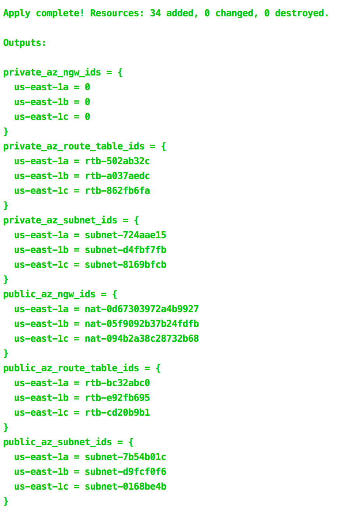

# terraform-aws-subnets

Terraform module for multi-AZ [`subnets`](http://docs.aws.amazon.com/AmazonVPC/latest/UserGuide/VPC_Subnets.html) provisioning.

The module creates private and public subnets in the provided Availability Zones.

The public subnets are routed to the Internet Gateway specified by `var.igw_id`.

`nat_gateway_enabled` flag controls the creation of NAT Gateways in the public subnets.

The private subnets are routed to the NAT Gateways provided in the `var.az_ngw_ids` map.


## Screenshots



*Example of `terraform apply` outputs*


## Usage


```hcl
module "vpc" {
  source     = "git::https://github.com/ceibo-it/terraform-aws-vpc.git?ref=0.0.1"
  namespace  = var.namespace
  stage      = var.stage
  name       = var.name
  cidr_block = var.cidr_block
}

module "public_subnets" {
  source              = "git::https://github.com/ceibo-it/terraform-aws-subnets.git?ref=0.0.1"
  namespace           = var.namespace
  stage               = var.stage
  name                = var.name
  availability_zones  = ["us-east-2a", "us-east-2b", "us-east-2c"]
  vpc_id              = module.vpc.vpc_id
  cidr_blocks          = ["10.0.0.0/24", "10.0.1.0/24", "10.0.2.0/24"]
  type                = "public"
  igw_id              = module.vpc.igw_id
  nat_gateway_enabled = "true"
}

module "private_subnets" {
  source             = "git::https://github.com/ceibo-it/terraform-aws-subnets.git?ref=0.0.1"
  namespace          = var.namespace
  stage              = var.stage
  name               = var.name
  availability_zones = ["us-east-2a", "us-east-2b", "us-east-2c"]
  vpc_id             = module.vpc.vpc_id
  cidr_blocks         = ["10.0.10.0/24", "10.0.11.0/24", "10.0.12.0/24"]
  type               = "private"

  az_ngw_ids = module.public_subnets.az_ngw_ids
}
```


## Examples

Given the following configuration

```hcl
module "vpc" {
  source     = "git::https://github.com/ceibo-it/terraform-aws-vpc.git?ref=0.0.1"
  namespace  = var.namespace
  name       = "vpc"
  stage      = var.stage
  cidr_block = var.cidr_block
}

module "public_subnets" {
  source              = "git::https://github.com/ceibo-it/terraform-aws-multi-az-subnets.git?ref=0.0.1"
  namespace           = var.namespace
  stage               = var.stage
  name                = var.name
  availability_zones  = ["us-east-2a", "us-east-2b", "us-east-2c"]
  vpc_id              = module.vpc.vpc_id
  cidr_blocks          = ["10.0.0.0/24", "10.0.1.0/24", "10.0.2.0/24"]
  type                = "public"
  igw_id              = module.vpc.igw_id
  nat_gateway_enabled = "true"
}

module "private_subnets" {
  source              = "git::https://github.com/ceibo-it/terraform-aws-multi-az-subnets.git?ref=0.0.1"
  namespace           = var.namespace
  stage               = var.stage
  name                = var.name
  availability_zones  = ["us-east-2a", "us-east-2b", "us-east-2c"]
  vpc_id              = module.vpc.vpc_id
  cidr_blocks          = ["10.0.10.0/24", "10.0.11.0/24", "10.0.12.0/24"]
  type                = "private"
  az_ngw_ids          = module.public_subnets.az_ngw_ids
}

output "private_az_subnet_ids" {
  value = module.private_subnets.az_subnet_ids
}

output "public_az_subnet_ids" {
  value = module.public_subnets.az_subnet_ids
}
```

the output Maps of AZ names to subnet IDs look like these

```hcl
public_az_subnet_ids = {
  us-east-2a = subnet-ea58d78e
  us-east-2b = subnet-556ee131
  us-east-2c = subnet-6f54db0b
}
private_az_subnet_ids = {
  us-east-2a = subnet-376de253
  us-east-2b = subnet-9e53dcfa
  us-east-2c = subnet-a86fe0cc
}
```

and the created subnet IDs could be found by the AZ names using `map["key"]` or [`lookup(map, key, [default])`](https://www.terraform.io/docs/configuration/interpolation.html#lookup-map-key-default-),

for example:

`public_az_subnet_ids["us-east-2a"]`

`lookup(private_az_subnet_ids, "us-east-2b")`
<br/>


## Inputs

| Name | Description | Type | Default | Required |
|------|-------------|:----:|:-----:|:-----:|
| attributes | Additional attributes (e.g. `policy` or `role`) | list(string) | `<list>` | no |
| availability_zones | List of Availability Zones (e.g. `['us-east-1a', 'us-east-1b', 'us-east-1c']`) | list(string) | - | yes |
| az_ngw_ids | Only for private subnets. Map of AZ names to NAT Gateway IDs that are used as default routes when creating private subnets | map(string) | `<map>` | no |
| cidr_blocks | List of CIDR blocks corresponding with each Availability Zone (e.g. `['10.0.0.0/24', '10.0.1.0/24', '10.0.2.0/24']`) | string | - | yes |
| delimiter | Delimiter to be used between `namespace`, `stage`, `name` and `attributes` | string | `-` | no |
| enabled | Set to false to prevent the module from creating any resources | string | `true` | no |
| igw_id | Internet Gateway ID that is used as a default route when creating public subnets (e.g. `igw-9c26a123`) | string | `` | no |
| max_subnets | Maximum number of subnets that can be created. The variable is used for CIDR blocks calculation | string | `6` | no |
| name | Application or solution name | string | - | yes |
| namespace | Namespace (e.g. `cp` or `cloudposse`) | string | - | yes |
| nat_gateway_enabled | Flag to enable/disable NAT Gateways creation in public subnets | string | `true` | no |
| private_network_acl_egress | Egress network ACL rules | list(map(string)) | `<list>` | no |
| private_network_acl_id | Network ACL ID that is added to the private subnets. If empty, a new ACL will be created | string | `` | no |
| private_network_acl_ingress | Egress network ACL rules | list(map(string)) | `<list>` | no |
| public_network_acl_egress | Egress network ACL rules | list(map(string)) | `<list>` | no |
| public_network_acl_id | Network ACL ID that is added to the public subnets. If empty, a new ACL will be created | string | `` | no |
| public_network_acl_ingress | Egress network ACL rules | list(map(string)) | `<list>` | no |
| stage | Stage (e.g. `prod`, `dev`, `staging`) | string | - | yes |
| tags | Additional tags (e.g. map(`BusinessUnit`,`XYZ`) | map(string) | `<map>` | no |
| type | Type of subnets to create (`private` or `public`) | string | `private` | no |
| vpc_id | VPC ID | string | - | yes |

## Outputs

| Name | Description |
|------|-------------|
| az_ngw_ids | Map of AZ names to NAT Gateway IDs (only for public subnets) |
| az_route_table_ids | Map of AZ names to Route Table IDs |
| az_subnet_arns | Map of AZ names to subnet ARNs |
| az_subnet_ids | Map of AZ names to subnet IDs |


## Copyright

Copyright © 2017-2019 [Cloud Posse, LLC](https://cpco.io/copyright)


## License 

[](https://opensource.org/licenses/Apache-2.0) 

See [LICENSE](LICENSE) for full details.

    Licensed to the Apache Software Foundation (ASF) under one
    or more contributor license agreements.  See the NOTICE file
    distributed with this work for additional information
    regarding copyright ownership.  The ASF licenses this file
    to you under the Apache License, Version 2.0 (the
    "License"); you may not use this file except in compliance
    with the License.  You may obtain a copy of the License at

      https://www.apache.org/licenses/LICENSE-2.0

    Unless required by applicable law or agreed to in writing,
    software distributed under the License is distributed on an
    "AS IS" BASIS, WITHOUT WARRANTIES OR CONDITIONS OF ANY
    KIND, either express or implied.  See the License for the
    specific language governing permissions and limitations
    under the License.


## Trademarks

All other trademarks referenced herein are the property of their respective owners.


## NOTICE

terraform-aws-subnets
Copyright 2020 Ceibo


This product includes software developed by
Cloud Posse, LLC (c) (https://cloudposse.com/)
Licensed under Apache License, Version 2.0
Copyright © 2017-2019 Cloud Posse, LLC
